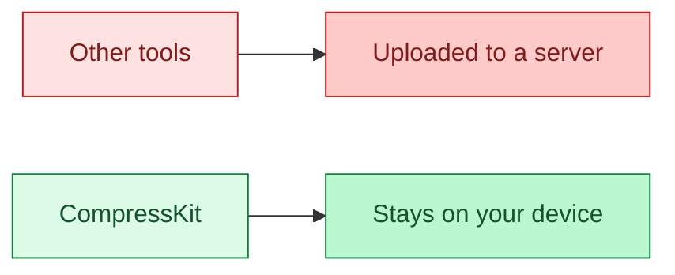
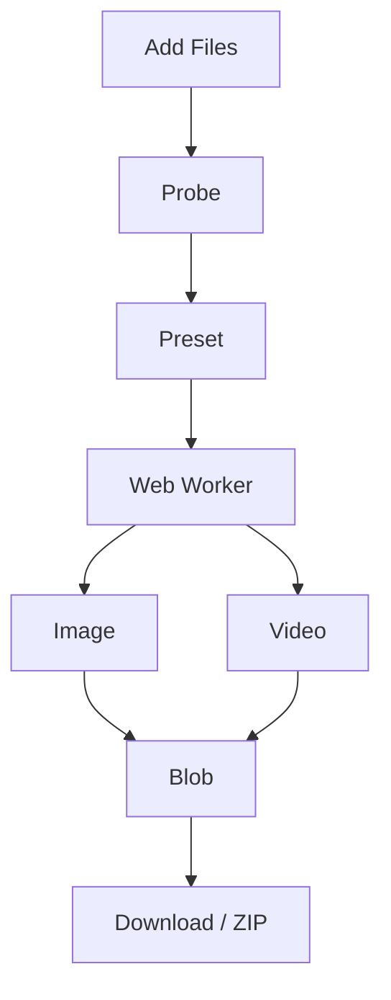
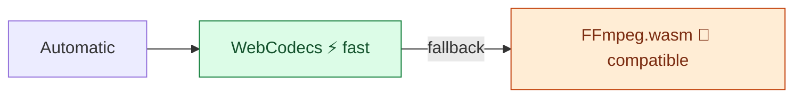
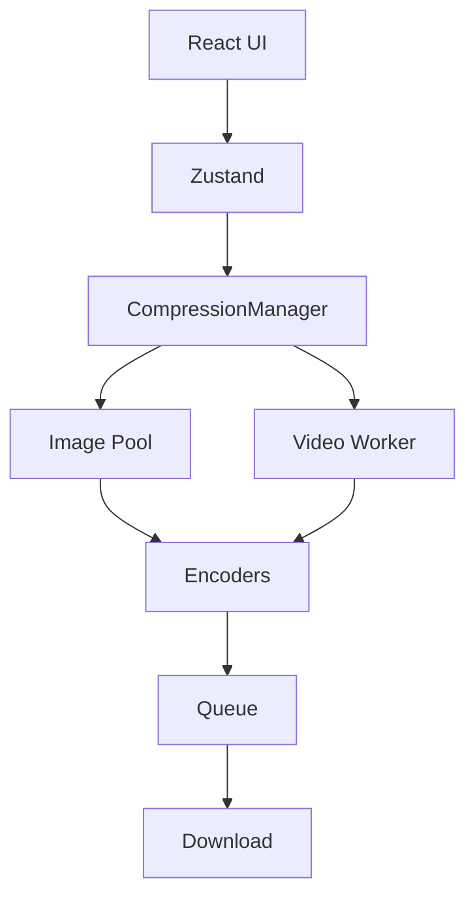

<div align="center">

# CompressKit

**Compress images & videos in your browser. Files never leave your device.**

[](https://github.com/Abhishek25062001/CompressKit)
[](https://react.dev)
[](https://nodejs.org)
[](#-quick-start)
[](#-license)

Designed and developed by **[Abhishek Jaiswal](https://abhishekjaiswal.net/)**

</div>

## 🔒 Why CompressKit



| | Other tools | CompressKit |
| --- | :---: | :---: |
| Uploads the file | ✅ | ❌ |
| Encodes on your device | ❌ | ✅ |
| Needs a backend | ✅ | ❌ |
| Keeps the original when it would not shrink | ❌ | ✅ |
| Images and video in one queue | ❌ | ✅ |

Static `dist/`. No server code, database, or API.

## 🛠️ Tools

| Tool | Address | What it does |
| --- | --- | --- |
| 🗜️ Compress | `/compress` | Shrink images and videos. Keep the original when it would not get smaller. |
| 🔄 Convert | `/convert` | Images, video, animated GIF, or audio. Always the format you asked for. |
| ✂️ Resize & Crop | `/resize` | Crop and scale photos to an exact pixel size. |
| 🪄 Remove Background | `/remove-background` | Cut out a subject with IS-Net on your device. Model is 88 MB and self-hosted. |
| 🎬 Trim & Split | `/trim-video` | Trim one clip, or split it into WhatsApp Status parts. |
| 📍 Remove Location | `/remove-location` | Strip GPS and other hidden metadata. Picture and sound are not re-encoded. |
| 📄 PDF | `/pdf` | Merge, split, compress, sign, scan, fill forms, protect, clean, or OCR. |

## ⚡ How It Works



> No server ever receives your file.

## 📊 Presets

| Preset | Image quality | Video quality | Audio |
| --- | ---: | ---: | --- |
| Maximum Quality | 90 | 85 | 192 kbps |
| ⭐ Balanced | 78 | 70 | 128 kbps |
| Maximum Compression | 60 | 45 | 96 kbps |

⭐ Balanced is the default.

## 🎯 Supported Formats

<table>
<thead><tr><th></th><th>Input</th><th>Output</th></tr></thead>
<tbody>
<tr><td><strong>Images</strong></td><td>JPG, PNG, WebP, AVIF, BMP, HEIC / HEIF</td><td>JPG, PNG, WebP, AVIF</td></tr>
<tr><td><strong>Video</strong></td><td>MP4, MOV, WebM, MKV, AVI, WMV, FLV, 3GP, animated GIF</td><td>MP4 (H.264), WebM (VP9 or VP8), animated GIF</td></tr>
<tr><td><strong>Audio</strong></td><td>Soundtrack of a video</td><td>MP3, M4A, WAV</td></tr>
</tbody>
</table>

Compress writes JPEG, WebP, AVIF, PNG, MP4, or WebM. Transparent images are not flattened into JPEG.

## 🧠 Two Video Engines



⚡ WebCodecs via Mediabunny when the browser can encode the file. 🐢 FFmpeg.wasm otherwise: H.264 (MP4) or VP8 (WebM), **~32 MB** on the first video job, then cached. H.265, VP9, and AV1 need WebCodecs; Automatic falls back and says so.

## 🏗️ Architecture



| Layer | Technology |
| --- | --- |
| UI | React 19, TypeScript |
| Build | Vite 8 → static `dist/` |
| Style | Tailwind CSS 4 |
| State | Zustand 5 |
| Images | Canvas, UPNG.js, `@jsquash/avif` |
| Video | WebCodecs, Mediabunny, `@ffmpeg/core` 0.12 |
| Cut-out | ONNX Runtime Web, IS-Net (88 MB, self-hosted) |
| ZIP | fflate, in the browser |
| Backend | None |

## 🚀 Quick Start

```bash
npm install
npm run dev
npm run build
```

| | |
| --- | --- |
| Node.js | 20.19+ |
| Build output | Static `dist/` · ~175 MB with the model |
| Server code | Zero |
| Environment variables | Zero |
| Database | None |

Serve `dist/` over HTTPS. One HTML file per tool. No functions, env file, or database.

## 🌐 Browser Support

| | Chrome / Edge 114+ | Firefox 130+ | Safari 17+ |
| --- | :---: | :---: | :---: |
| Image workers | ✅ | ✅ | ✅ |
| WebP encode | ✅ | ✅ | ❌ |
| AVIF encode | ✅ | ✅ | ✅ |
| WebCodecs video | ✅ | ✅ | ⚠️ |
| FFmpeg.wasm | ✅ | ✅ | ✅ |

⚠️ Safari WebCodecs varies by version. No WebP encode in Safari: JPEG, or PNG if the image has transparency. AVIF uses WebAssembly where canvas cannot write it.

## 📋 Limits

| | Images | Videos |
| --- | --- | --- |
| ⚠️ Warning | Over 60 MB | Over 1 GB |
| 🛑 Rejected | Over 400 MB | Over 4 GB |

## ⚠️ Known Limitations

- 🐢 FFmpeg.wasm is slow for 1080p and above. WebCodecs is faster when the browser has a hardware encoder.
- 💾 Very long or high-resolution video can run the tab out of memory.
- 🎛️ H.265, VP9, and AV1 are WebCodecs-only. This FFmpeg build’s H.265 hangs and its VP9 crashes, so they are not used.
- 🎚️ HDR video becomes 8-bit SDR 4:2:0.
- 🖼️ Animated WebP and APNG become a single frame.
- 👁️ Some MKV and HEVC files cannot be previewed. FFmpeg can still compress them.
- 🧭 Safari cannot encode WebP.
- 🧠 Without WebGPU, background removal runs on the CPU: about a minute per photo.

## 📜 License

CompressKit’s own code is proprietary. Copyright © 2026 Abhishek Jaiswal. Personal or internal use is free. You may not copy, redistribute, publish changes, sell, or use the source to build a competing product. See [`LICENSE`](LICENSE).

| Package | License |
| --- | --- |
| `@ffmpeg/core` | GPL-2.0-or-later |
| `libheif-js` | LGPL-3.0 |
| `@cantoo/pdf-lib` | MIT |
| `pdfjs-dist` | Apache-2.0 |
| `tesseract.js` | Apache-2.0 |
| `onnxruntime-web` | MIT |
| IS-Net | Apache-2.0 / MIT |

> ⚠️ Shipping a build that includes `@ffmpeg/core` carries GPL-2.0-or-later obligations. Review that before you distribute, or ship WebCodecs only.

## 🔗 Links

| | |
| --- | --- |
| Website | [abhishekjaiswal.net](https://abhishekjaiswal.net/) |

<div align="center">

If CompressKit saves you time, drop a ⭐ on the repo.

</div>
