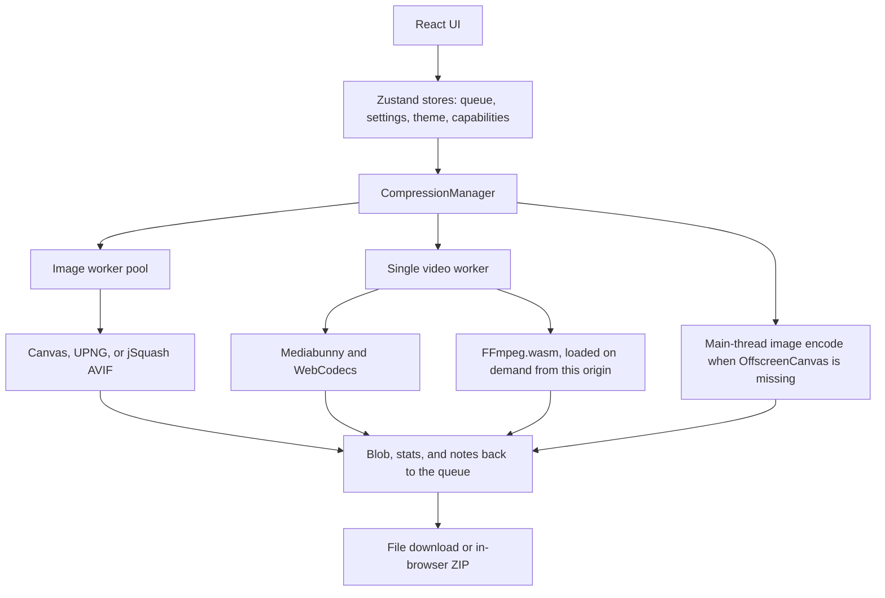

# CompressKit

> Compress images and videos in the browser. Files stay on the device.

CompressKit is a client-side web app for shrinking images and videos, converting them between formats, cropping photos to exact sizes, trimming videos or splitting them into WhatsApp Status parts, and building or splitting PDFs, without uploading them. Decoding, encoding, previews, and ZIP creation run on the visitor’s computer, inside Web Workers.

**Version 1.0.0** · **React 19** · **Node.js 20.19+** · **Static site, no backend**

Designed and developed by **[Abhishek Jaiswal](https://abhishekjaiswal.net/)** ·

---

## Product overview

CompressKit is a private media compressor. You open it in a browser, add files, choose a quality level, and download smaller copies.

It was built for a common tradeoff: online compressors are convenient, but they require sending photos and videos to someone else’s server. CompressKit keeps that convenience in a single page and does the work locally. There is no account, no upload form, and no server that receives the media.

It is for people who need smaller files and want the original to remain on their machine: anyone preparing images for the web, sharing a video, or cleaning a batch of files before they leave the device.

---

## The problem

### Without CompressKit

Typical options are a website that uploads the file, or a desktop encoder that has to be installed and configured. Upload tools add a wait, a privacy decision, and a file-size cap set by the service. Desktop tools are capable, but they are a separate install, and batch settings are easy to get wrong.

### With CompressKit

You open a page, drop files in, pick a preset or adjust quality, and download the results. The browser encodes them. A batch can be downloaded as one ZIP, built on the device. If a re-encode in the same format would not be smaller, CompressKit keeps the original and says so.

The app does not claim a fixed speed or size improvement. Results depend on the source file, the settings, and the computer doing the work.

---

## What makes it different

These differences come from how the app is built.

**Files stay in the tab.** The File API reads each file and passes it to a worker. There is no upload path. That matters when the photo or video should not be sent to a third party in order to be compressed.

**One page for images and video.** JPEG, PNG, WebP, AVIF, MP4, MOV, WebM, and MKV go through the same queue, presets, and download step. You do not switch tools when a folder contains both.

**Two video engines, chosen per file.** Automatic mode tries WebCodecs (hardware encoding through Mediabunny) and falls back to a self-hosted FFmpeg.wasm build when that file cannot be encoded in the browser. You get speed where the browser can provide it, and a compatible path where it cannot.

**Honest output.** Progress is a percentage only when it is measured. If the new file is not smaller, the UI says so instead of quietly handing back a larger file under a “compressed” name. Transparent images are not flattened into JPEG.

**Nothing to operate on a server.** `npm run build` produces a static `dist/` folder. Hosting is file serving. There is no database, account system, or API to run beside it.

---

## Key features

### Compressing files

**Image compression.** JPEG, PNG, WebP, and AVIF in. JPEG, WebP, AVIF, or PNG out, or the same format as the original. Quality runs from 1 to 100. Optional max width and height scale a picture down and never enlarge it. EXIF orientation is respected. A transparent image that would have become JPEG is saved as WebP, or as PNG when WebP encoding is unavailable.

**Target file size.** Turn on **Target file size** under **Images**, then type a limit in KB or pick 20, 50, 100, 200, or 500 KB. This is what job, exam, and government upload forms ask for. CompressKit searches for the highest quality that fits. If quality 40 is still too large, it scales the picture down rather than making it blocky. Only a picture that would become tiny gets a lower quality. A PNG is saved as JPEG (or WebP, when it has transparency), because PNG cannot be steered to a size. A file already under the limit is returned unchanged. The limit also works per file, for example 50 KB for a photo and 20 KB for a signature.

**PNG optimization.** Below quality 90, PNG output is palette-quantized with UPNG.js (256 colors from 50 upward, 128 below that). At 90 and above, PNG is re-encoded losslessly.

**AVIF encoding.** The browser’s canvas encoder is used when it can write AVIF. Otherwise a WebAssembly encoder (`@jsquash/avif`, libavif) loads only for that job.

**Video compression.** MP4, MOV, WebM, and MKV in. MP4 or WebM out. You set container, codec, quality, a short-side resolution cap (4K down to 360p, or original), a frame-rate cap (60, 30, 24, or original), and audio bitrate, including removing audio. Resolution never upscales.

**Presets.** Maximum Quality, Balanced (the default), and Maximum Compression set image quality, video quality, and audio bitrate together. Changing a slider away from those values marks the settings as custom. Each file can override the global settings.

**Original kept when it is already smaller.** If the output is the same format, was not resized, and is not smaller than the source, the original bytes are returned. The file is labeled already optimal. A resized or format-changed file that is not smaller is still returned, with a note that it did not shrink.

### Converting files

The **Convert** tool sits next to the compressor. Open it with the **Compress | Convert** switch above the drop zone, the **Convert Files** button in the hero, the **Convert** link in the header, or a link ending in `#convert`. It has its own queue, so compressing and converting never mix.

| Input | Output |
| --- | --- |
| JPG, PNG, WebP, AVIF, BMP, HEIC / HEIF (iPhone photos) | JPG, PNG, WebP, or AVIF |
| MP4, MOV, WebM, MKV, AVI, WMV, FLV, 3GP, animated GIF | MP4 (H.264), WebM (VP9 or VP8), animated GIF, MP3, M4A, or WAV |

**Always the format you asked for.** The converter never swaps in the original because it was smaller. Converting a transparent image to JPG fills the transparent areas with white, as image editors do. PNG output is lossless.

**Animated GIF.** Built by FFmpeg in two passes. The first computes a palette for the clip, the second applies it, at 12 frames per second and a width of 320, 480, or 720 px, or the original width. Smaller videos are never enlarged.

**Audio extraction.** MP3 and M4A are written at 192 kbps, and WAV as 16-bit PCM. A video with no sound track fails with a clear message.

**HEIC photos.** Safari decodes HEIC itself. Other browsers use libheif compiled to WebAssembly (about 2 MB), which loads only when a HEIC file is converted. The rotation stored in the photo is applied. Chrome and Firefox cannot show a HEIC thumbnail in the queue, so those cards show an icon until the file is converted.

**Older containers.** AVI, WMV, FLV, 3GP, and GIF inputs are decoded by FFmpeg.wasm, so they need the one-time engine download.

### Resizing photos

The **Resize** tool crops photos and scales them to an exact pixel size. Open it with the **Resize** tab above the drop zone, the **Resize Photos** button in the hero, the **Resize** link in the header, or a link ending in `#resize`. It takes JPG, PNG, WebP, AVIF, and BMP. Convert HEIC photos to JPG first.

| Preset | Output (px) |
| --- | --- |
| Passport photo, 35 × 45 mm | 413 × 531 |
| US passport / visa, 2 × 2 in | 600 × 600 |
| Signature, 3.5 × 1.5 cm | 413 × 177 |
| Profile picture (WhatsApp, LinkedIn) | 800 × 800 |
| Instagram post | 1080 × 1080 |
| Instagram portrait, 4:5 | 1080 × 1350 |
| Story / Status, 9:16 | 1080 × 1920 |
| YouTube thumbnail | 1280 × 720 |
| X (Twitter) header | 1500 × 500 |
| LinkedIn banner | 1584 × 396 |
| Custom | Any width and height up to 8000 |
| Freehand | Whatever you crop, at the original resolution |

Document sizes are at 300 DPI. Always check the exact size your form asks for, and use **Custom** when it differs.

**Cropping.** By default the largest centered area with the preset's shape is used. The crop button on a photo opens an editor. Drag the box to move it, or drag a corner to resize it with the shape locked. Arrow keys move it, and **+** and **−** resize it. A crop is remembered for that photo while the preset keeps the same shape, and saving a crop on a finished photo queues it again.

**Freehand.** Crop any rectangle, with no fixed shape. The crop box gets edge handles as well as corner handles, so one side can move on its own. The output is the cropped area at the original resolution, for example 1845 × 1126 from a 3000 × 2000 photo. Until you draw a crop, the whole photo is kept. A crop drawn for a preset also works in Freehand. A freehand crop is set aside when you switch to a preset, because its shape would not match.

**Exact size, optional KB limit.** Except in Freehand, the output is always exactly the preset's pixel size, enlarging small photos when needed. Choose JPG, PNG, or WebP. With **Target file size** on, only quality is lowered until the file fits, because the dimensions are fixed. A PNG is then saved as JPG on white, which is what upload forms accept. Files are named like `photo-413x531.jpg`.

### Trimming and splitting videos

The **Trim** tool cuts one video on a timeline. Open it with the **Trim** tab above the drop zone, the **Trim Video** button in the hero, the **Trim** link in the header, or a link ending in `#trim`. It takes MP4, MOV, WebM, and MKV.

**Timeline.** The video plays above a strip of frames from the clip. Drag the two handles to set the start and end, click the strip to move the playhead, or type times such as `1:05.5`. **Here** sets the start or end to the frame on screen, and **Play selection** plays only the part you keep. The handles also move with the arrow keys (0.1 s, or 1 s with Shift), Page Up and Page Down (5 s), Home, and End. A file this browser cannot play (for example HEVC in some browsers) can still be cut by typing the times.

**Trim** keeps the selected part as one clip, named like `video-trimmed.mp4`.

**Split for Status** cuts the selected part into consecutive parts of at most 60 seconds, the length of a WhatsApp Status video, so they play back to back. 10, 15, 30, and 90 seconds are also available. The timeline marks where each part begins, and the panel lists their lengths before you start. Parts are named like `video-part-1-of-3.mp4`, and **Download all** packs them into a ZIP. On a phone, **Share** opens the system share sheet, from which WhatsApp can post them to your status.

| Cut | How it works | Trade-off |
| --- | --- | --- |
| **Fast** (default) | Copies the encoded video and audio with Mediabunny. Nothing is re-encoded. | No quality loss and usually under a second. Cuts land on key frames: a clip can start slightly before the time you picked, and parts end on the last key frame that keeps them under the limit, so they can be a little shorter. The container is kept (MP4 and MOV become MP4, WebM stays WebM, MKV stays MKV). |
| **Exact** | Re-encodes each part to H.264 MP4 with AAC sound, with WebCodecs where possible and FFmpeg.wasm otherwise. | Cuts on the exact frame, and the output plays everywhere. Slower, and the resolution can be capped at 1080p, 720p, or 480p. |

A fast cut falls back to re-encoding, with a note, when the video cannot be copied: its key frames are too far apart to keep parts under the limit, or its codec cannot be stored in the output container. **Keep sound** off removes the audio track. Parts never run over the limit: fast cuts leave out the audio frame that straddles a cut, and re-encoded parts leave 0.1 s for the padding an AAC encoder adds.

### PDF tools

The **PDF** tab works on pages instead of files. Open it with the **PDF** tab above the drop zone, the **PDF Tools** button in the hero, the **PDF** link in the header, or a link ending in `#pdf`. Add PDFs and photos (JPG, PNG, WebP, HEIC, AVIF, BMP). Every page of every PDF, and every photo, becomes a thumbnail on one board.

**Organize.** Drag pages to reorder them, or use the arrow buttons under each page, which also work on phones and from the keyboard. Rotate a page 90° at a time, or remove it. Click pages to select them, or type ranges such as `1-3, 7` or `5-` under **Split**.

| Action | What you get |
| --- | --- |
| **Save PDF** | One PDF of all pages, or only the selected ones, in board order. This covers photos to PDF, merging, extracting pages, and saving a reordered copy. |
| **Split** | Separate PDFs of N pages each (1 by default), downloaded as a ZIP. |
| **To images** | Each page as JPG or PNG at 72, 150, or 300 DPI, as a ZIP when there are several. |
| **Compress** | A smaller PDF: photos and scans inside are recompressed (Light, Medium, or Strong), with an optional size target. |
| **Sign** | Draw, type, or upload a signature, then place it on one page or all of them, and download the signed PDF. |
| **Scan** | Straighten phone photos of documents to the page edges and give them a clean scanned look. |
| **Forms** | Fill in a PDF form's fields and download it with the answers. |
| **Protect** | Download a password-protected copy (AES-256), with printing and copying allowed or not. |
| **Clean** | See the hidden details your files carry, and remove comments. Saved PDFs never include the rest. |
| **OCR** | Read the text in scans and photos, and save a PDF where that text can be searched and copied. |

The ten tools sit in a grid above the options. **All** or **Selected** pages applies to every tool.

**Pages from PDFs** are copied unchanged, so text stays sharp and selectable. Rotation is stored as page rotation, not by redrawing the page.

**Pages from photos** are placed on A4, US Letter, or a page that fits the photo, with automatic or fixed orientation and no, small, or large margins. The photo's own orientation (EXIF) is applied, so phone photos are not sideways. **Standard** quality scales large photos to about 200 DPI on an A4 page, which is sharp for reading and printing and keeps files small. **Original** keeps full resolution. Transparent images are embedded as PNG, and the rest as JPEG.

**Page numbers and watermark.** Under **Save**, **Add to every page** turns on page numbers and a watermark. They are also added when splitting and compressing. Page numbers come in six positions and four styles ("Page 1 of 5", "Page 1", "1 / 5", "1"), with a start number and an option to skip a cover page. Numbering counts the pages of each file you download. The watermark is faint text across the middle of each page, diagonal or straight, in three sizes and adjustable strength. It is drawn by the browser, so any language works. Both follow each page's rotation, so they appear upright where a reader expects them.

**Compress.** Only JPEG photos in grayscale or RGB are rewritten: smaller (2400, 1600, or 1100 px on the long side) and at lower quality. A photo is kept as it was when re-encoding would not save at least 10%. Text, fonts, and drawings are not touched, so text stays sharp and selectable. With a target (for example 200 KB), CompressKit starts at the chosen strength and steps up until the file fits. If it still does not fit, **Flatten pages if needed** (off by default) turns each page into a single image at 150, 110, then 80 DPI. That makes text unselectable and unsearchable, so the result message always says when it happened, and when the target could not be reached. PDFs of mostly text are usually small already and are reported as such. Pages from one PDF are copied together, so shared fonts and images are stored once.

**Sign.** Draw a signature with a mouse, finger, or pen, type your name in a handwriting-style font, or upload a photo of a signature. Uploads can have the white paper removed, so only the ink shows. Press the pen button under a page to place it: drag to move it, drag the corner to resize it (its shape is kept), and add it more than once. Signed pages show a **Signed** badge. **Apply to all pages** puts it on every page (or every selected page) in one step: in the same spot as a page you already signed, or at the bottom right. The placement dialog has the same button. **Download signed PDF** is right in the Sign tab. The signature is kept in memory for this tab only and is never saved or uploaded. It is a picture of a signature, not a certified digital signature.

**Logo watermark.** Under **Save**, the watermark can be **Text** or **Logo**. A logo on white can have the white removed. Like the signature, it stays in memory only.

**Scan cleanup.** Each photo page has a **Scan** button. It opens an editor with four draggable corners, placed automatically on the page edges when the page stands out from what is behind it. Beside it is a live preview of the straightened page. Choose a look: **Original**, **Enhanced** (per-channel levels, which also removes the yellow or blue cast of indoor light), **Grayscale**, or **Black & white**. Black & white uses a local threshold, so shadows across the page do not turn black. The **Scan** tool does the same for many photos at once. Cleanup applies everywhere the photo is used: saved PDFs, images, previews, and OCR.

**Forms.** Every fill-in field of each PDF is listed: text boxes, check boxes, choices, and lists. Answers are written onto the page when you download (the form is flattened), so they look the same in every viewer and survive merging. Answers stay in memory only. The standard PDF font covers Latin letters, numbers, and common symbols; other scripts get a clear error. XFA forms (Adobe LiveCycle) cannot be filled in a browser. A form PDF saved without answers keeps the look of its fields, but they are no longer fillable.

**Passwords.** Adding a locked PDF asks for its password. It is used once to open the file and never stored, and a wrong password asks again. Pages from an unlocked file are saved without a password. **Protect** adds one (AES-256), with a random owner password so the printing and copying choices hold in standard readers. Losing the password means losing access to the file.

**Clean.** Lists what each file carries: document title, author, subject, keywords, software, dates, XMP metadata, attachments, scripts, and comments for PDFs; camera, date taken, editing software, and GPS location for JPEG photos. PDFs saved here are new documents: none of those details are copied, photos are re-drawn without EXIF, and page-level metadata and open actions are removed. Comments and markup are kept unless **Remove comments and markup** is on. You can set your own title and author.

**OCR.** Uses Tesseract (English), with its worker, WebAssembly core, and language data served from this site under `ocr/`, never from a CDN. About 7 MB loads the first time; after that each page takes a few seconds. Each word is placed as invisible text over the page, aligned to the page as displayed, so the PDF looks unchanged but can be searched, selected, and copied. **Also download the text** saves a `.txt` file. Pages that already have real text are skipped.

**Limits.** pdf-lib and pdf.js (about 1.5 MB) load only when the PDF tab is first used, and OCR (about 7 MB) only when it is first run. The work runs on the main thread, so very large PDFs (hundreds of pages, or tens of MB) can make the page pause while they are built. Compression skips CMYK photos, PNG-style (lossless) images, and masked images inside PDFs. OCR, the hidden text layer, and form answers support Latin script only. Automatic page-edge detection needs the page to stand out from the background; otherwise place the corners by hand.

### Working with a batch

**Queue.** Drop files, pick them from a dialog, or paste them. Unsupported types are skipped with a notice. Each card shows type, size, dimensions, and, for video, duration.

**Parallel images, one video at a time.** Several images can encode at once. One video runs at a time, because a transcode already uses the CPU or hardware encoder.

**Per-file controls.** Cancel one file or all of them. Retry a failed or cancelled file. Remove a file or clear the queue. Cancellation terminates the worker, which releases its memory.

**Results.** Each finished card shows original size, compressed size, and the percentage saved. Expand it for dimensions, format, engine, elapsed time, notes, a before/after slider for images, or synced side-by-side playback for videos.

**Downloads.** Download one file, or download every completed file. A single result downloads directly. Several results are packed into a ZIP in the browser (fflate, stored without recompressing the media).

### Using the app itself

**Themes.** Light, dark, and system. The choice is stored in `localStorage`.

**Layout.** Usable from 320px wide. A skip link jumps to the compressor. `prefers-reduced-motion` is respected.

**Installable shell.** A web app manifest and a service worker cache the app’s own pages and static assets. After the first visit, the interface can load offline. The video engine is cached after it is downloaded once. User files are never put in that cache.

**Browser capability notes.** The settings panel reports which image formats and video codecs the current browser can encode, so an unavailable choice is labeled before you start.

---

## How it works

```text
You add files in the browser
        ↓
The page reads type, size, dimensions, duration, and a small thumbnail
        ↓
You choose a preset or custom settings, then start compression
        ↓
CompressionManager assigns each file to a Web Worker
        ↓
Images → canvas, PNG quantizer, or WebAssembly AVIF
Videos → WebCodecs when it can encode the file, otherwise FFmpeg.wasm
        ↓
The worker returns a Blob (or the original, when it was already smaller)
        ↓
You compare and download the file, or a ZIP of the batch
```

Nothing in that path sends the file to a server. The only related network request is the first video job: the worker downloads the FFmpeg engine (about 32 MB) from the same site that served the app, then the browser caches it. Image jobs do not need that download.

### Image workflow

1. Add one or more images.
2. In **Compression settings**, leave **Balanced** or pick another preset.
3. Under **Images**, set output format, quality, and whether to keep the original dimensions.
4. Select **Compress**.
5. Open a finished card to compare, then download it. For several files, use **Download all**.

### Video workflow

1. Add a video. The first time, the app downloads the FFmpeg engine in the background if WebCodecs cannot handle the file, or if you chose the FFmpeg engine.
2. Under **Videos**, set format, codec, quality, resolution, frame rate, audio, and engine. **Automatic** is the default.
3. Select **Compress**. Progress is a percentage when the encoder reports one; otherwise the card shows the current stage.
4. Play the result next to the original, then download it.

### What each step is doing

| Step | What happens |
| --- | --- |
| Add | The file is validated against supported types and size limits, then queued. |
| Probe | A detached image or video element reads metadata. The thumbnail is a small WebP, not a full decode. |
| Schedule | Image workers run in a pool of up to four. One video worker runs a single job. |
| Encode | Heavy work stays off the UI thread. Browsers without `OffscreenCanvas` encode images on the main thread instead. |
| Finish | The queue stores the blob, stats, and notes. Object URLs are revoked when you remove or replace the file. |

---

## Real-world use cases

### Use case: Shrink photos before sending them

**Problem:** Messaging and email choke on multi-megabyte photos, and a web compressor means uploading the pictures.

**How CompressKit helps:** You compress locally, see the size change, and download the smaller file.

**Typical workflow:** Drop the photos, keep **Balanced**, compress, check the percentage on each card, download.

### Use case: Prepare images for a website

**Problem:** Source exports are large, and you want WebP or AVIF plus a maximum width.

**How CompressKit helps:** Output format and max width/height are settings. Aspect ratio is kept, and images are not enlarged. Transparency is preserved instead of being flattened into JPEG.

**Typical workflow:** Add the exports, set format to WebP or AVIF, turn off **Preserve resolution**, set a max width, compress, and download the batch as a ZIP.

### Use case: Make a video easier to share

**Problem:** A screen recording or camera file is larger than it needs to be for a chat, a ticket, or a page.

**How CompressKit helps:** You can cap the short side (for example 1080p or 720p), cap frame rate, lower quality, or remove audio. Where the browser has a hardware encoder, WebCodecs does the work. Otherwise FFmpeg.wasm does.

**Typical workflow:** Add the video, set resolution and quality, leave the engine on **Automatic**, compress, preview both copies, download.

### Use case: Check quality before replacing the original

**Problem:** A smaller file is only useful if it still looks acceptable.

**How CompressKit helps:** Images get a before/after slider. Videos play side by side. Stats include sizes, dimensions, format, engine, and time. If the original was already smaller in the same format, it is returned unchanged.

**Typical workflow:** Compress, expand the card, compare, then download or retry with different settings.

### Use case: Hand someone a compressor without running a media server

**Problem:** A team wants a shared compressor but does not want to store customer or employee media.

**How CompressKit helps:** Deploy the static build. Visitors’ browsers do the encoding. The host sees normal page requests, including the one-time engine download, and does not receive the files.

**Typical workflow:** Build `dist/`, host it, and send people the URL. They use the page as described above. There are no accounts to manage.

---

## Product tour

Screenshots are not in this repository yet.

<!-- TODO: Add hero / empty drop zone screenshot -->

### Empty state

The landing page introduces the product. The compressor is a drop zone: drag files in, browse, or paste. Navigation links jump to Features, How it works, and Privacy.

<!-- TODO: Add queue and settings screenshot -->

### Queue and settings

After files are added, the left column lists them with status, size, and actions. The right column is **Compression settings**: presets, then image or video controls, plus a note about what this browser can encode. On smaller screens the settings sit below the queue.

<!-- TODO: Add image before/after screenshot -->

### Image comparison

Expand a finished image to see original and compressed sizes, dimensions, format, engine, time, and a slider between the two pictures.

<!-- TODO: Add video side-by-side screenshot -->

### Video comparison

Expand a finished video for the same stats plus duration, and side-by-side playback of the original and the result.

<!-- TODO: Add completion summary screenshot -->

### Batch download

When a run finishes, a summary shows how many files finished, the size change, and the percentage smaller. One finished file uses **Download**. More than one uses **Download All (.zip)**, which builds `compresskit-YYYY-MM-DD.zip`. **Compress More** clears the queue.

---

## How to use it

### Add files

1. Open the app.
2. Drop files on the page, choose them from the file dialog, or paste images or videos (paste is ignored while a text field is focused).
3. Files the app does not recognize are skipped. You will see a notice naming them.
4. Files over the hard size limit are listed as failed. Files over the soft limit are accepted with a memory warning.

Supported input:

| Kind | Types |
| --- | --- |
| Images | JPG, JPEG, JFIF, PNG, WebP, AVIF |
| Videos | MP4, M4V, MOV, WebM, MKV |

| Limit | Images | Videos |
| --- | --- | --- |
| Warning | Over 60 MB | Over 1 GB |
| Rejected | Over 400 MB | Over 4 GB |

### Convert formats

1. Select **Convert** in the switch above the drop zone.
2. Add files the same way as for compression.
3. In **Conversion settings**, choose the image format under **Images** and the video, GIF, or audio format under **Videos**.
4. Select **Convert**, then download each file or **Download All (.zip)**. The ZIP is named `compresskit-converted-YYYY-MM-DD.zip`, and converted files keep their base name with the new extension.

### Choose settings

1. Pick **Maximum Quality**, **Balanced**, or **Maximum Compression**.
2. Open **Images** or **Videos** for finer control.
3. **Reset** restores the defaults.
4. For one file only, use the sliders icon on its card and choose **Save for this file**. The card is marked **Custom** and keeps those settings when the global ones change. **Use global settings** clears the override. Saving settings on a finished, failed, or cancelled file puts it back in the queue.

| Preset | Image quality | Video quality | Audio |
| --- | --- | --- | --- |
| Maximum Quality | 90 | 85 | 192 kbps |
| Balanced | 78 | 70 | 128 kbps |
| Maximum Compression | 60 | 45 | 96 kbps |

Image controls: output format (same as original, WebP, AVIF, JPEG, PNG), quality, preserve resolution, and optional max width and height.

Video controls: MP4 or WebM, codec, quality, resolution, frame rate, audio bitrate or **Remove audio**, and engine.

| Container | Codecs you can select |
| --- | --- |
| MP4 | H.264, H.265 / HEVC, AV1 |
| WebM | VP9, VP8, AV1 |

| Engine | Behavior |
| --- | --- |
| Automatic | WebCodecs first. FFmpeg.wasm if that file cannot be encoded that way. |
| WebCodecs | Hardware path only. Disabled when this browser has no WebCodecs. Fails clearly if the codec is unavailable. |
| FFmpeg.wasm | Software encode. Most compatible. Slower. |

H.265, VP9, and AV1 are produced through WebCodecs when the browser can encode them. The bundled FFmpeg build is used for H.264 (MP4) and VP8 (WebM). If you asked for a codec FFmpeg cannot encode reliably, Automatic mode switches to that fallback and tells you on the result.

### Compress, compare, and download

1. Select **Compress**. The button counts how many files are waiting.
2. Watch each card. Cancel one file, or **Cancel all**.
3. Expand a finished card to compare.
4. **Download** on the card saves that file. Names of newly encoded files end in `-compressed` before the extension. An original that was kept keeps its base name.
5. The completion summary’s button is **Download** for one file and **Download All (.zip)** for several. The ZIP is named `compresskit-YYYY-MM-DD.zip`.
6. **Clear** removes the queue. **Compress More** on the summary does the same. Closing the tab releases the files from memory.

Theme is the control in the header: light, dark, or match the system.

---

## User roles and permissions

CompressKit has no accounts, roles, or permission model. Anyone who can open the page can compress files in their own browser. Nothing is shared between visitors.

---

## Architecture



There is no backend service, database, authentication provider, payment system, or third-party media API.

| Piece | Role |
| --- | --- |
| React UI | Drop zone, queue, settings, comparisons, marketing sections on the same page. |
| Zustand | Queue state, settings, theme, detected browser capabilities, and short-lived notices. |
| CompressionManager | Starts, cancels, retries, and clears jobs. Images use a pool sized from CPU cores, capped at four. Video uses one worker. |
| Image worker | `OffscreenCanvas`, UPNG.js for PNG, `@jsquash/avif` when native AVIF encoding is missing. |
| Video worker | Mediabunny for demux and mux. WebCodecs when `canEncode` succeeds at the output size. Otherwise FFmpeg.wasm. |
| Static host | Serves the built site and, on first video use, the FFmpeg core. It does not receive user media. |
| Service worker | Caches this origin’s app shell and hashed assets, including the engine after it has been fetched. Network-first for page loads so a new deploy can show up. |
| `localStorage` | Theme and compression preferences only. |

Workers send error codes. The UI maps those codes to short messages. Raw error detail goes to the console.

Memory choices that affect behavior:

- Queue thumbnails are small WebP renders.
- A full-size object URL exists while a comparison is open, and is revoked on remove, replace, or clear.
- FFmpeg reads the source through `WORKERFS` instead of copying the whole file into the WebAssembly heap. WebCodecs reads it lazily through Mediabunny’s `BlobSource`.
- Idle image workers stop after 20 seconds. The video worker stops after 60 seconds. Stopping a worker releases its WebAssembly heap.

---

## Technology stack

| Layer | Technology | Purpose |
| --- | --- | --- |
| UI | React 19, TypeScript | Single-page interface. |
| Build | Vite 8 | Dev server and static production build. |
| Styling | Tailwind CSS 4 | Layout and theme tokens. |
| State | Zustand 5 | Queue, settings, theme, capabilities, notices. Persists theme and settings. |
| Motion and icons | Framer Motion, Lucide React | Animation and icons. Motion follows `prefers-reduced-motion`. |
| Fonts | Inter, JetBrains Mono (`@fontsource-variable`) | Bundled from this origin. |
| Images | Canvas / `OffscreenCanvas`, `createImageBitmap`, `upng-js`, `@jsquash/avif` | Decode, resize, and encode. |
| Video | WebCodecs, Mediabunny, `@ffmpeg/core` 0.12 | Hardware encode when available; software encode as fallback. |
| Archives | fflate | ZIP download in the browser, without recompressing media. |
| Offline shell | Service worker, web app manifest | Cache the app’s own static files. |
| Backend | None | No server code, database, or environment variables. |
| Tests | None in this repository | `lint` and `typecheck` are the automated checks. |

---

## Project structure

```text
compresskit/
├── index.html
├── vite.config.ts
├── package.json
├── public/
│   ├── favicon.svg
│   ├── manifest.webmanifest
│   ├── robots.txt
│   └── sw.js
└── src/
    ├── App.tsx                 page shell
    ├── components/             layout, sections, upload, queue, settings, results, preview
    ├── features/
    │   ├── compression/        manager, intake, downloads, worker slots
    │   ├── image/              resize and encode
    │   ├── trim/               video trimmer: lossless key-frame cuts, part planning, jobs
    │   └── video/              WebCodecs and FFmpeg engines, quality mapping
    ├── workers/                image.worker.ts, video.worker.ts, trim.worker.ts
    ├── store/                  queue, settings, theme, capabilities, UI notices
    ├── hooks/                  theme, object URLs, queue summary
    ├── utils/                  probe, zip, filenames, browser and codec detection
    ├── constants/              formats, presets, error copy
    └── types/                  media, settings, worker messages
```

`public/sw.js` is the offline cache. User media never goes through it.

`vite.config.ts` keeps `@ffmpeg/core` and `@jsquash/avif` out of Vite’s pre-bundle so their `.wasm` files resolve from `import.meta.url` and are served from your origin.

---

## API

CompressKit does not expose an HTTP API. Compression is a browser job, not a request to this project.

---

## Privacy and security

There is no login. Authentication is not part of the product.

What the code does:

- Files are read with the File API and transferred to workers. There is no `FormData` upload and no request that sends file bytes to another origin.
- FFmpeg, the AVIF encoder, fonts, and icons are loaded from the same origin as the page.
- `localStorage` stores the theme and compression preferences.
- The service worker caches only this site’s static files. Its fetch handler ignores other origins.
- Re-encoded images are produced by canvas or a quantizer, so camera EXIF, including location, is dropped. Re-encoded videos are written without copying source metadata tags. A file that is kept as the original is returned byte for byte.
- The host that serves the website still sees ordinary requests for the page and assets, the same as any static site. CompressKit does not add analytics.

This is a description of the data path, not a claim that every browser or hosting setup is risk-free. Anyone who can use the computer can see files you leave open in the tab.

### FFmpeg license

`@ffmpeg/core` bundles FFmpeg with libx264 and is licensed **GPL-2.0-or-later**. Shipping a build that includes it carries GPL obligations. Review that before commercial distribution, or remove the FFmpeg fallback and keep WebCodecs only. The PDF tools use `@cantoo/pdf-lib` (MIT, a maintained fork of pdf-lib with encryption support) and `pdfjs-dist` (Apache-2.0). OCR uses `tesseract.js` and `tesseract.js-core` (Apache-2.0) with English data from `@tesseract.js-data/eng` (Apache-2.0 data, MIT package). The HEIC decoder, `libheif-js`, is LGPL-3.0. It is loaded as a separate, unmodified module, which the LGPL allows, but keep its license notice when you distribute a build. Other dependencies in this project use MIT, Apache-2.0, or MPL-2.0.

The CompressKit project itself has no `LICENSE` file. See [License](#license).

---

## Deployment

`npm run build` is the whole release step. Upload `dist/` to a static host such as Netlify, Vercel, GitHub Pages, S3 with CloudFront, or nginx.

- Serve the site over HTTPS. Service workers and some media APIs require it.
- The FFmpeg `.wasm` file is about 32 MB. Enable gzip or brotli for `.wasm`; that cuts the transfer to roughly a third. It is downloaded on the first video compression, then cached.
- Some hosts limit a single file. Cloudflare Pages, for example, caps files around 25 MB, which is too small for this wasm asset. On those hosts, use a different host or serve that one file from storage on the same site.
- A host such as Vercel only needs to serve the static build. You do not add serverless functions, environment variables, or a database. Confirm the host allows a single file of about 32 MB. The visitor’s CPU and RAM still do the compression.
- For a subpath (for example `example.com/compresskit/`), set `base` in `vite.config.ts` and update the paths in `index.html` and `public/manifest.webmanifest`.
- The multi-threaded FFmpeg core needs `SharedArrayBuffer` and cross-origin isolation headers. This app uses the single-threaded core so a normal static host works without those headers.

There is no Dockerfile, CI workflow, or host config file in the repository. Deployment is “build, then serve `dist/`”.

### Browser support

Figures below match the support notes shipped with this version. Check current browser release notes before you rely on a specific codec.

| Capability | Chrome / Edge 114+ | Firefox 130+ | Safari 17+ |
| --- | --- | --- | --- |
| Image compression in workers (`OffscreenCanvas`) | Yes | Yes | Yes (16.4+) |
| WebP encoding | Yes | Yes | No. Falls back to JPEG, or PNG when the image has transparency. |
| AVIF encoding | Native canvas or WebAssembly | WebAssembly | WebAssembly |
| WebCodecs video | Yes. Codecs depend on OS and GPU. | Yes. Codecs vary. | Partial, and it varies by version. |
| FFmpeg.wasm fallback | Yes | Yes | Yes |

Older browsers without `OffscreenCanvas` fall back to main-thread image encoding. Video needs module workers.

Codec availability is not the same as container support. Open-source Chromium builds often cannot decode H.264, so MP4 input there goes through FFmpeg. If a browser cannot preview MKV or HEVC, compression can still run through FFmpeg.

---


## FAQ

### Who is this for?

Anyone who wants smaller images or videos without sending them to a server, and anyone hosting a static copy of that tool for other people.

### Does compression need a backend?

No. Hosting the built files is enough. The browser does the encoding.

### Does it need an internet connection?

The first load needs the network to fetch the app. After that, the service worker can open the interface offline. The first video that needs FFmpeg also needs the network once, to download the engine. Later video jobs can use the cached engine. Image compression does not download an engine.

### Do I need an account?

No.

### Will it always make files smaller?

No. When a same-format re-encode would not shrink the file and you did not resize it, CompressKit returns the original and says it was already optimal. If you change format or resolution and the result is larger, you still get the new file, with a note.

### Can I self-host it?

Yes. Build `dist/` and serve it as static files. See [Deployment](#deployment).

### Is my file uploaded if I use the hosted page?

The media is processed in that browser tab. It is not posted to an application server. The host still receives ordinary requests for HTML, JavaScript, and the FFmpeg asset.

### Why is there an FFmpeg download during video compression?

That request fetches the encoder (~32 MB, smaller with compression), from the same origin as the app. It is not an upload of your video.

---

## Roadmap

This repository does not contain a roadmap, issue list, or `TODO` / `FIXME` markers that describe unfinished product work.

### Completed

The features in [Key features](#key-features) are implemented in this tree, including local image and video encoding, presets, per-file overrides, comparisons, ZIP download, themes, and the offline app shell.

### In progress

Nothing in the repository is marked in progress.

### Planned

Nothing in the repository is marked as planned. Treat ideas that are not in the code as unbuilt.

---

## Limitations

- **FFmpeg.wasm is slow** for high-resolution video. Hardware WebCodecs is faster where the browser and GPU provide it.
- **Memory.** Very long or very large videos can crash the tab. Hard stops are 400 MB for images and 4 GB for video. Warnings start at 60 MB and 1 GB.
- **Codecs follow the browser and OS.** H.265, VP9, and AV1 are WebCodecs-only. The FFmpeg fallback is H.264 or VP8. This FFmpeg build’s libx265 hangs and its libvpx-vp9 crashes, so those encoders are not used.
- **HDR video** is converted to 8-bit SDR 4:2:0.
- **Animated images** (animated WebP, APNG) become a single frame.
- **Some inputs cannot be previewed** in the browser (for example some MKV or HEVC files). Compression can still succeed through FFmpeg.
- **WebP encoding is missing in Safari.** Output falls back to JPEG, or PNG when the image has transparency.
- **PWA icons.** `public/manifest.webmanifest` references `public/icons/icon-192.png`, `icon-512.png`, and `icon-maskable-512.png`. Those PNG files are not in the repository. `public/favicon.svg` is. Installed icons may be generic until the PNGs are added.
- **No automated test suite.** Quality checks in-repo are ESLint and TypeScript.
- **GPL on the video engine.** Distributing the FFmpeg.wasm core has license duties. See [FFmpeg license](#ffmpeg-license).

---

## Contributing

There is no contributing guide or code of conduct in the repository. `package.json` marks the package `private` (it is not published to npm).

If you are changing the code locally:

1. Create a branch.
2. Make the change.
3. Run `npm run lint` and `npm run typecheck`.
4. Open a pull request if you have a remote and permission to contribute.

Do not add secrets, `.env` files, or credentials. None are used.

---

## License

License information for the CompressKit source has not been specified. There is no `LICENSE` file.

The bundled `@ffmpeg/core` package is GPL-2.0-or-later. That obligation is separate from the missing project license. Read [FFmpeg license](#ffmpeg-license) before you distribute a build.

---

## Support

For setup problems, start with [Troubleshooting](#troubleshooting). For product behavior, the in-app error text and the notes on each result card are the user-facing explanation.

To report a bug or ask a question, open an issue at [github.com/Abhishek25062001/CompressKit/issues](https://github.com/Abhishek25062001/CompressKit/issues).

---

## Author

**Abhishek Jaiswal** designed and developed CompressKit.

- GitHub: [@Abhishek25062001](https://github.com/Abhishek25062001)
- Project: [github.com/Abhishek25062001/CompressKit](https://github.com/Abhishek25062001/CompressKit)

If CompressKit is useful to you, a star on the repository is appreciated.
